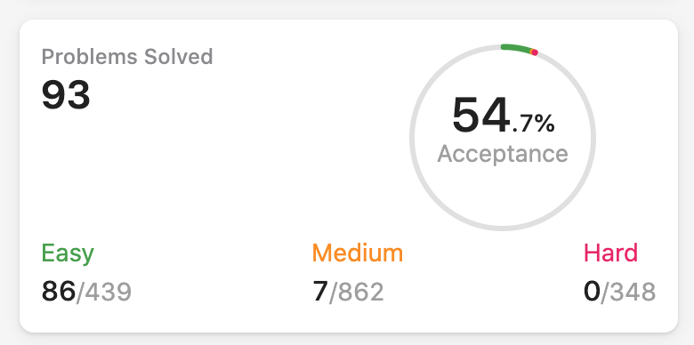

//Ngan Kim Khong's algos.

Process: 152. Maximum Product Subarray
in: https://leetcode.com/discuss/general-discussion/460599/blind-75-leetcode-questions

150 most common:
https://learntocodetogether.com/top-150-leetcodes-best-practice-problems/

// 50 Medium question = pramp
