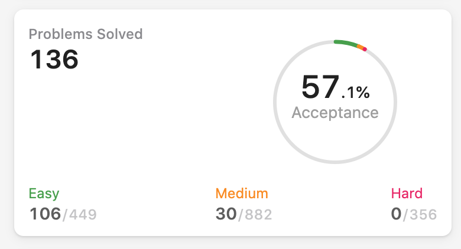

//Ngan Kim Khong's algos.

Process: 371. Sum of Two Integers Nevermind I skip binary

in: https://leetcode.com/discuss/general-discussion/460599/blind-75-leetcode-questions
Process: 322. Coin Change
Tree: Invert/Flip Binary Tree

150 most common:
https://learntocodetogether.com/top-150-leetcodes-best-practice-problems/

// 50 Medium question = pramp
